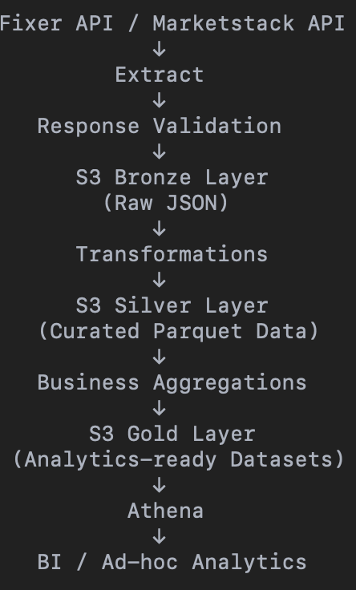

# Overview

Market Analytics Data Platform is a cloud-native data engineering project that ingests foreign exchange and equity market data from external APIs, processes the data through a layered lakehouse architecture, and produces analytics-ready datasets for querying and visualization.

The platform extracts market data from Fixer and Marketstack APIs, stores immutable raw data in Amazon S3, transforms and standardizes the data into curated datasets, and generates business-oriented analytical datasets for market analysis and reporting. The project demonstrates production-oriented data engineering practices including incremental data ingestion, schema validation, data quality checks, partitioned storage, and layered data modeling.

## Objectives

- Ingest foreign exchange rates and equity market data from external APIs.
- Implement a Bronze, Silver, and Gold data lake architecture.
- Build resilient and reproducible ELT pipelines with strong typing and schema validation.
- Produce analytics-ready datasets optimized for querying and reporting.
- Demonstrate modern data engineering practices using AWS services and Python.

## Architecture

## Key Features

- Incremental and historical market data ingestion
- Strongly typed request and response models using Pydantic
- Immutable raw data storage for auditability and reprocessing
- Layered data lake architecture (Bronze → Silver → Gold)
- Data quality validation and schema enforcement
- Partitioned datasets for efficient querying
- Analytics-ready datasets for market intelligence and reporting

## Data Sources

- Fixer API – Foreign exchange rates and currency metadata
- Marketstack API – Equity reference data and end-of-day market prices

## Technology Stack

- Language: Python
- Cloud Platform: AWS
- Storage: Amazon S3
- Query Engine: Amazon Athena
- Data Formats: JSON, Parquet, Apache Iceberg
- Validation: Pydantic
- Scheduling: Cron or Amazon EventBridge Scheduler
- Analytics: SQL and BI tools (Tableau)